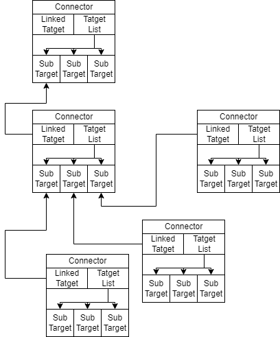

### Connector

Connector 是用於連接遊戲中的元件，並且會記錄連接到哪一個 Target再交由 Target 將兩個物件綁定在一起。
在遊戲中，兩個或多個元件的連接並不會形成一個環，而是以一棵樹的形式存在。
因為在連接元件時玩家會將元件以及以直接或間接連接到他身上的元件一同選取起來

#### 連接情況

#### LOAD
##### LOAD ID

需要提供自己的 Connector ID 以及自己所有的 Target ID。

##### LOAD LINK

需要提供 Connector 將要連接到的 Target 物件。

#### DUMP

提交自己的 Connector ID、連接到的 Target ID 以及自己所有的 Target ID，Dump 出的格式為 Connector.cs 中定義的 ConnectorInfo。

#### 有關編輯模式與拖曳

- SwitchCombineMode(bool)  
	用於使 Connector 進入或退出編輯模式。
- SwitchSelecting(bool)  
	用於選定或取消選定 Connector。
- HitTriggerUpdate()  
	用於更新 Collider 碰撞到的 Target。(應該要進入選取中才使用這個 function)
- TrackPositionUpdate(vec2)  
	用於指定元件應該要被移動到甚麼位置，例如玩家選取了一個物件之後使用游標拖曳，那麼將游標的 world position 以參數傳入就能使元件跟隨游標移動。(應該要進入選取中才使用這個 function)